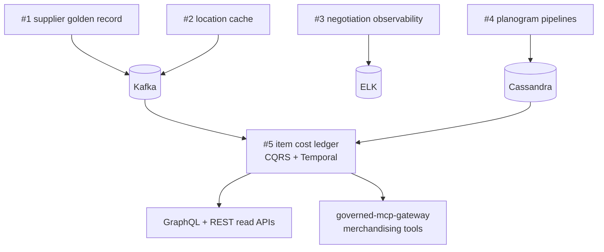

# Mizbauddin Mohammad

### Director-scope Platform & Enterprise Architecture (TOGAF) — Principal Software Engineer, Sr. Manager II

I lead platform and enterprise architecture programs at Fortune-1 scale — **managing staff and solutions architects** alongside engineering managers, tech leads, and developers. My organization spans **45+ engineers, architects, and managers**; **80+ engineers** across eight cross-functional teams; and systems consumed by **300+ enterprise applications** at **50K+ TPS** and **99.99% uptime**. Recent outcomes include **$5.1M+ annual cloud savings** (FinOps + architecture), **$1.2M mainframe retirement**, and **governed GenAI/agentic platforms** in production.

I am a **player-coach for architects** — I set enterprise architecture direction, ADR standards, and review-board bar; I coach **15+ senior and staff engineers into architecture and leadership roles**. The repositories below are an **open Enterprise Platform Reference Architecture**: runnable ADRs, system design, CI, and one-command local runs — the reference patterns I expect architects on my teams to deliver, published for regulated industries (banking, healthcare, insurance, retail).

**Reach me:** [LinkedIn](https://www.linkedin.com/in/mizba) · [Medium](https://medium.com/@mizbauddin.md)

> **Pinned on profile:** `payments-modernization-platform` · `item-cost-ledger-platform` · `agentic-rag-engine` · `governed-mcp-gateway` · `supplier-golden-record-platform` · `mizbamd` (this README)

---

### Leadership scope (Director lens)

| Dimension | Scale |
|---|---|
| **Architect org** | Manage **staff and solutions architects** plus engineering managers and tech leads — not only IC developers |
| **Organization** | 45+ engineers, architects, and managers; 8 cross-functional teams (~80 engineers) |
| **Talent** | Coach and develop **15+ senior/staff engineers into architecture and leadership**; raise architecture bar across domains |
| **Business outcomes** | $5.1M+ annual cloud savings · $1.2M mainframe OPEX eliminated · ~50% deployment frequency improvement |
| **Platform scale** | 50K+ TPS · 99.99% uptime · 300+ consuming applications |
| **Programs** | Merchandising cost/price/negotiations · supply chain · space · analytics · data & AI platform modernization |
| **Governance** | ADRs · **architecture review boards** · SLO/SLI standards · **Area Tech Review Council** (50+ major initiatives) |

---

### Featured work — Enterprise Platform Reference Architecture (Java + Python)

Each repo reframes a domain I owned at scale as a domain-agnostic capability — with ADRs, system-design docs, tests, CI, and Docker Compose. The same patterns map to banking, healthcare, asset management, retail, and product companies.

| Repository | Stack | What it proves |
|---|---|---|
| **[payments-modernization-platform](https://github.com/mizbamd/payments-modernization-platform)** | Java / Spring | Modernize a legacy core with **zero big-bang**: Strangler Fig, Anti-Corruption Layer, CDC, **CQRS + event sourcing**, orchestration **SAGA** + compensation, canary |
| **[agentic-rag-engine](https://github.com/mizbamd/agentic-rag-engine)** | Python / FastAPI | Production **RAG**: hybrid retrieval (vector + BM25 + RRF), reranking, **grounded answers with guardrails**, LangGraph agent, eval harness |
| **[governed-mcp-gateway](https://github.com/mizbamd/governed-mcp-gateway)** | Java + Python | **Governed agentic AI**: MCP servers, policy engine, **human-in-the-loop**, hash-chained audit, PCI/HIPAA/retail redaction |
| **[pricing-orchestration](https://github.com/mizbamd/pricing-orchestration)** | Java / Spring | **MACH** + DDD pricing platform: rules engine, workflow orchestration, choreography **SAGA**, canary |
| **[streaming-lakehouse-platform](https://github.com/mizbamd/streaming-lakehouse-platform)** | Python / PySpark | **Medallion lakehouse** on Delta Lake: Kafka + CDC, CQRS read models, feature store, data-quality quarantine |

> A distributed transaction with compensation is a *payment settlement* (banking), a *claims adjudication* (healthcare), a *trade/position update* (asset management), and a *price-change rollout* (retail). Same SAGA. Same CQRS. Different nouns.

---

### Retail platform reference — *Platforms That Can't Fail* (5-repo series)

Five retail subdomains — each repo is one technology pillar, wired as one coherent platform story.

| # | Repository | Stack | Capability |
|---|---|---|---|
| 1 | **[supplier-golden-record-platform](https://github.com/mizbamd/supplier-golden-record-platform)** | Kafka · Cassandra | Multi-source **supplier MDM** → golden record + CDC |
| 2 | **[location-reference-cache](https://github.com/mizbamd/location-reference-cache)** | Redis · RabbitMQ | **Location read tier** — read-through cache, event invalidation |
| 3 | **[supplier-negotiation-observability](https://github.com/mizbamd/supplier-negotiation-observability)** | Elasticsearch · Logstash | **Negotiation observability** — correlation IDs, regulated redaction, stalled-deal SLOs |
| 4 | **[microspace-planogram-platform](https://github.com/mizbamd/microspace-planogram-platform)** | Airflow · Flink · Cassandra | **Planogram pipelines** — item × club × fixture at scale |
| 5 | **[item-cost-ledger-platform](https://github.com/mizbamd/item-cost-ledger-platform)** | Temporal · Kafka · CQRS | **Item cost ledger** (keystone) — event sourcing, GraphQL + REST, OpenTelemetry + Grafana SLOs |

### Research & focused labs

| Lab | What it proves |
|---|---|
| **[scalable-enterprise-rag](https://github.com/mizbamd/scalable-enterprise-rag)** | Dual-path enterprise RAG — offline prep + online hybrid, ACL, abstain, ops metrics |
| **[enterprise-ai-platform-planes](https://github.com/mizbamd/enterprise-ai-platform-planes)** | Five-plane enterprise AI architecture — model gateway, facade APIs, control/FinOps |
| **[finops-platform-landing-zone](https://github.com/mizbamd/finops-platform-landing-zone)** | Azure landing zone IaC — FinOps tags, budgets, AKS, Event Hubs, Databricks, Cosmos/Redis |
| **[cassandra-tombstone-lab](https://github.com/mizbamd/cassandra-tombstone-lab)** | IJESAT 2024 research — reproducible tombstone/compaction experiments |
| **[structured-streaming-retail-slo](https://github.com/mizbamd/structured-streaming-retail-slo)** | Supplier CDC freshness + cost projection lag SLOs |
| **[quantum-retail-optimization-lab](https://github.com/mizbamd/quantum-retail-optimization-lab)** | QUBO shelf allocation vs classical greedy (simulator) |

---

### Toolbox
`Java` · `Spring Boot` · `Kafka` · `Temporal` · `Cassandra` · `Redis` · `Flink` · `Airflow` · `GraphQL` · `Python` · `FastAPI` · `PySpark` · `Delta Lake` · `Kubernetes` · `Docker` · `Azure` · `GCP` · `Terraform`  
`CQRS / Event Sourcing` · `SAGA` · `MACH` · `DDD` · `Strangler Fig` · `RAG` · `LangGraph` · `MCP` · `Agentic AI` · `TOGAF` · `FinOps`

### Credentials
- Microsoft Certified: **Agentic AI** Business Solutions Architect (2026)
- Microsoft Certified: **Azure AI Engineer** Associate (2025)
- **TOGAF** Enterprise Architecture, Part 1 & 2 (v10, 2025)
- **Oracle Certified Master**, Java EE 6 Enterprise Architect (2012)
- Google Advanced Data Analytics Professional Certificate (2023)

### Writing
- "Managing Tombstones in Cassandra and Elasticsearch," IJESAT, Vol. 24, Issue 3 (2024) — **[reproducible lab](https://github.com/mizbamd/cassandra-tombstone-lab)**
- "Live Supplier Catalog and Pricing for Omnichannel," IJCSMC, Vol. 13, Issue 3 (2024)
