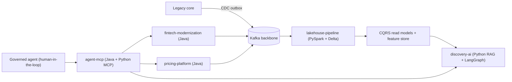

# Mizbauddin Mohammad

**Principal Software Engineer / Enterprise Architect (TOGAF)** -- distributed systems, data & AI platforms at global enterprise scale.

20+ years architecting and hands-on building mission-critical Java/Spring and Kafka platforms (50K+ TPS, 99.99% uptime, 300+ consuming applications), modernizing legacy systems of record, and productionizing GenAI / Agentic AI. I build the patterns that regulated, high-stakes enterprises depend on -- and I can show you the code.

> Replace `your-github-username` below with your handle. This file goes in a repo named exactly your username (e.g. `your-github-username/your-github-username`) to render on your GitHub profile.

---

## Enterprise Platform Reference Architecture

A polyglot (Java + Python) portfolio of architect-grade reference implementations. Each repo reframes a real platform domain built at global enterprise scale as a domain-agnostic capability, with explicit "Industry Applicability" docs mapping the patterns to healthcare, financial services, private equity, retail, product, and restaurant enterprises.

> A distributed financial transaction with compensation is a **payment settlement** (banking), a **claims adjudication** (healthcare), a **trade/position update** (asset management), and a **price-change rollout** (retail). Same SAGA. Same CQRS ledger. Different nouns.

### Pinned repositories

| Repo | Lang | What it demonstrates |
|------|------|----------------------|
| [fintech-modernization](https://github.com/your-github-username/fintech-modernization) | Java / Spring | Strangler Fig, Anti-Corruption Layer, CDC, **CQRS + event sourcing**, orchestration **SAGA**, parallel-run reconciliation, **canary** |
| [pricing-platform](https://github.com/your-github-username/pricing-platform) | Java / Spring | **MACH**, DDD, rules engine, approval **workflow orchestration** (Camunda/Temporal-style), **choreography SAGA**, canary |
| [discovery-ai](https://github.com/your-github-username/discovery-ai) | Python | **Hybrid RAG** (vector + BM25 + RRF), reranking, grounded answers, guardrails, **LangGraph** agent, eval harness |
| [agent-mcp](https://github.com/your-github-username/agent-mcp) | Java + Python | Governed **MCP** servers in both languages, **human-in-the-loop** approvals, RBAC policy, hash-chained audit |
| [lakehouse-pipeline](https://github.com/your-github-username/lakehouse-pipeline) | Python / PySpark | **Medallion lakehouse**, **Delta Lake**, Kafka streaming, CDC ACL, CQRS read model, feature store |

### Industry mapping

| Pattern | Banking | Healthcare | Asset mgmt / PE | Retail / Restaurant |
|---|---|---|---|---|
| Ledger + SAGA + compensation | payments settlement | claims adjudication | trade/position settlement | order settlement / payouts |
| Legacy modernization (Strangler/ACL/CDC) | mainframe exit | claims platform exit | OMS/portfolio exit | ERP/POS modernization |
| Hybrid search + RAG | research/docs | clinical search | diligence Q&A | catalog/menu search |
| Governed agents (MCP + HITL) | maker-checker | clinician sign-off | PM sign-off | manager approval |
| Lakehouse + feature store | risk/fraud | risk adjustment | signals | demand/churn |

---

## Core stack
`Java` `Spring Boot` `Kafka` `gRPC` `Python` `FastAPI` `PySpark` `Delta Lake` `Kubernetes` `Docker`
`Azure` `GCP` `AWS` `CQRS / Event Sourcing` `SAGA` `MACH` `DDD` `RAG` `LangGraph` `MCP` `Agentic AI`

## Certifications
- Microsoft Certified: Agentic AI Business Solutions Architect (2026)
- Microsoft Certified: Azure AI Engineer Associate (2025)
- TOGAF Enterprise Architecture Part 1 & 2, v10 (2025)
- Google Advanced Data Analytics Professional Certificate (2023)
- Oracle Certified Master, Java EE 6 Enterprise Architect (2012)

## Selected publications
- "Managing Tombstones in Cassandra and Elastic Search," IJESAT, Vol. 24, Issue 3 (2024)
- "Live Supplier Catalog and Pricing for Omnichannel," IJCSMC, Vol. 13, Issue 3 (2024)

## Connect
- LinkedIn: https://www.linkedin.com/in/mizba
